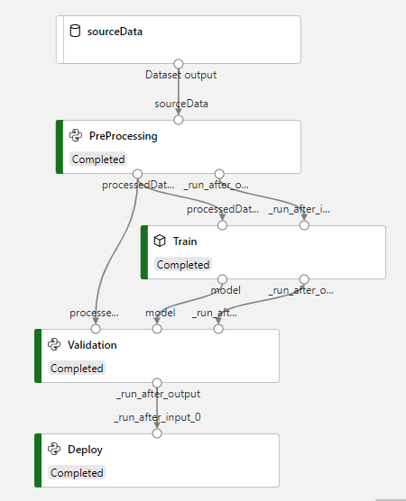

# Example description

## Pre-requsites:
1. Create 3 Azure Blob containers with name source-blob, processed-blob, models-blob respectively
2. Upload reviews.csv into source-blob

## Run the code

cd examples/http_trigger_scikit_learn_train_azure_function_image_acr_model_hosting

python PipelineRunner.py --tenantId <> --subscriptionId <> --resourceGroup <> --amlWorkspaceName <> --appId <> --appPassword <> --storageAccountName <> --storageAccountKey <> --computeTargetClusterName <> --acrPassword <>